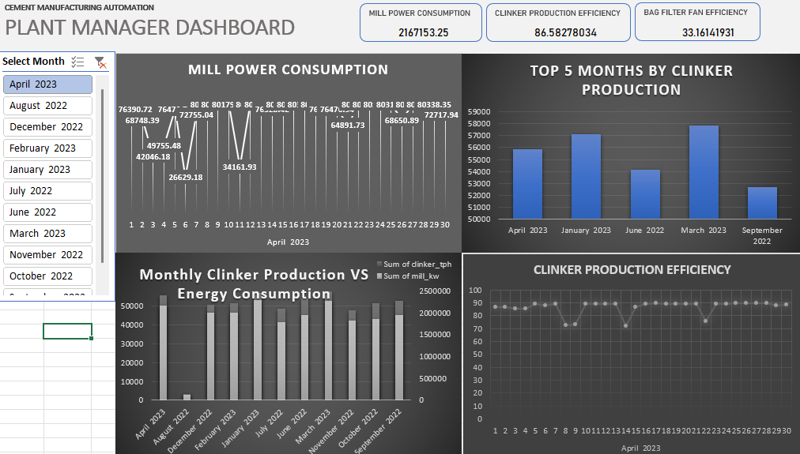

# Cement Manufacturing Automation

This repository documents a project aimed at optimizing and automating quality control in cement manufacturing. The project targeted reducing the time intervals between quality checks, minimizing manual intervention, and lowering cement residue, ultimately achieving significant cost savings.

## 📝 Project Overview

**Client**: Leading Cement Manufacturer  
**Project Objective**: Minimize the time between quality check intervals and reduce manual intervention in the manufacturing process.  
**Business Problem**: Regular quality checks are conducted every hour to ensure cement quality, but the time interval and manual intervention create inefficiencies.

### Business Goals and Constraints

- **Objective**: Minimize the time between quality checks.
- **Constraints**: Reduce manual intervention and cement residue.

### Success Criteria

- **Business Success**: Achieve a 50% reduction in time between quality check intervals.
- **Economic Success**: Generate a cost saving of at least $1 million.

## 📊 Key Responsibilities

1. **Data Collection & Analysis**: Analyzed operational data to identify bottlenecks and optimize the timing for quality checks.
2. **Process Automation**: Developed strategies to reduce manual intervention in quality checks, using data-driven automation.
3. **Efficiency Improvement**: Implemented changes that decreased manual intervention and enhanced the manufacturing process.
4. **Reporting & Metrics**: Created reports to monitor success metrics, providing insights into interval reduction and cost savings.

## 🛠️ Tools & Technologies

- **Programming Languages**: Python, SQL
- **Data Analysis Libraries**: Pandas, NumPy
- **Visualization & Reporting**: Tableau, Excel

## 📈 Project Results

- **Interval Reduction**: Reduced quality check intervals by 50%, achieving the business goal.
- **Cost Savings**: Projected cost savings surpassed $1 million, meeting the economic success criteria.
- **Operational Efficiency**: Decreased cement residue and minimized manual intervention, enhancing overall productivity.

## 📊 Dashboards

Below are sample dashboards created to track the progress and performance of the automation system.

### Quality Check Interval Dashboard
This dashboard visualizes for plant manager and improvements over time.




## 📂 Repository Structure

```plaintext
cement-manufacturing-automation/
├── data/                     # Contains raw and processed datasets
├── notebooks/                # Jupyter notebooks with EDA and analysis
├── reports/                  # Dashboards and visualizations
├── src/                      # Python scripts for data processing and automation
└── README.md                 # Project README file
```
##📫 Contact
For further inquiries or collaboration opportunities, please reach out:

- **Name**: Balakrithik G.
- **Email**: balakrithik7700@gmail.com
- **LinkedIn**: Balakrithik G (https://www.linkedin.com/in/balakrithik-g/)
